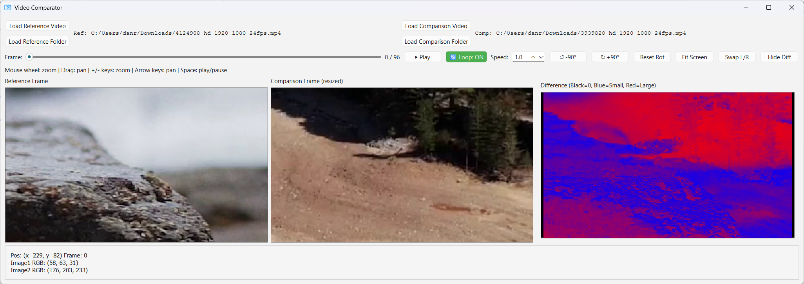

# Video Comparator

A desktop application for **side-by-side video comparison** with pixel-level analysis, frame-by-frame navigation, and interactive zoom/pan controls.

## Quick Start

1. **Download** `VideoComparator.exe` 
2. **Run** the executable
3. Load your reference and comparison videos/folders
4. Compare frame-by-frame

## Features

### Core Comparison Tools
- **Load & Compare Two Sources**
  - Video files: MP4, AVI, MOV, MKV, FLV, WMV
  - Folders of images: JPG, JPEG, PNG, BMP, TIFF, TIF, WEBP
  - Automatic frame synchronization

- **Three-Pane View**
  - **Left**: Reference frame (original)
  - **Middle**: Comparison frame (auto-resized to match reference)
  - **Right**: Difference view (color-coded visualization)

- **Difference Highlighting**
  - **Black**: No visible difference
  - **Blue**: Small differences
  - **Red**: Large differences

### Playback Controls
- **Play/Pause**: Spacebar or button click
- **Frame Slider**: Manual frame scrubbing with frame counter
- **Speed Control**: 0.1× (slow-mo) to 5.0× (fast-forward)
- **Loop Toggle**: Auto-repeat at end of video
- **Hide/Show Diff**: Toggle difference pane to improve performance

### Interactive Viewing
- **Zoom**: 0.1× to 8.0×
  - Mouse wheel scroll or `+` / `-` keys
  - Maintains aspect ratio and prevents distortion
- **Pan**: Drag with mouse or use arrow keys
  - Auto-constrained to keep image in view
- **Rotate**: ±90° rotation buttons or `Reset Rot`
- **Fit Screen**: Auto-scale to window size

### Pixel Inspector
- **Hover over any frame** to see real-time pixel data:
  - Exact coordinates (x, y)
  - RGB values from reference image
  - RGB values from comparison image
  - Frame number

### Convenience Features
- **Swap L/R**: Instantly swap reference and comparison
- **Drag & Drop**: Drop videos/folders directly onto viewers
  - Left viewer = reference
  - Middle viewer = comparison
- **Detailed Logging**: `logs/video_comparator.log` for troubleshooting

## Usage Guide

### Loading Videos or Images

**Using Buttons**
1. Click **Load Reference Video** or **Load Reference Folder** (left side)
2. Click **Load Comparison Video** or **Load Comparison Folder** (right side)
3. Select your files and click Open

**Using Drag & Drop** (Faster!)
1. Drag your reference video/folder onto the **LEFT** viewer
2. Drag your comparison video/folder onto the **MIDDLE** viewer
3. Done! Frames will sync automatically

### Playing Videos

1. Click **▶ Play** or press **Spacebar**
2. Use **Speed** control to adjust playback rate
3. Toggle **🔄 Loop** to enable auto-looping
4. Scrub through frames with the **Frame Slider**

### Viewing & Navigation

**Zoom**
- Scroll mouse wheel (up = zoom in, down = zoom out)
- Press `+` or `-` keys

**Pan**
- Click and drag with left mouse button
- Use arrow keys (`↑` `↓` `←` `→`)

**Rotate**
- Click **↺ -90°** to rotate counter-clockwise
- Click **↻ +90°** to rotate clockwise
- Click **Reset Rot** to return to 0°

**Fit to Window**
- Click **Fit Screen** to auto-scale both frames

### Inspecting Pixels

1. Move your cursor over any of the three viewers
2. Watch the **RGB panel** at the bottom update in real-time
3. See exact coordinates and color values for both images

This is useful for:
- Checking color accuracy
- Finding encoding artifacts
- Verifying pixel-perfect matches
- Quality assurance

### Performance Tips

**For Smooth Playback**
- Click **Hide Diff** to disable difference calculation
  - This can **2× your frame rate** on high-res videos
- Use lower resolution source videos if playback is choppy
- Close other applications to free up CPU/memory

**Video Limits**
- Videos are automatically sampled (~300 frame limit)
- This ensures the app runs smoothly on any system
- Very long videos won't consume excessive memory

## Keyboard Shortcuts

| Key | Action |
|-----|--------|
| `Space` | Play/Pause |
| `+` or `=` | Zoom in |
| `-` | Zoom out |
| `↑` | Pan up |
| `↓` | Pan down |
| `←` | Pan left |
| `→` | Pan right |

## Troubleshooting

### "No frames displayed" or "Failed to load"
1. Check that the file format is supported
   - Videos: MP4, AVI, MOV, MKV, FLV, WMV
   - Images: JPG, PNG, BMP, TIFF, WEBP
2. Try with a different file to rule out corruption
3. Check `logs/video_comparator.log` for error details

### Playback is choppy or stutters
**Solution**: Click **Hide Diff** to disable difference calculations
- This is the most effective performance boost
- Difference view requires extra processing per frame
- Hiding it can improve frame rate by 2-4×

### Spacebar doesn't work for play/pause
1. Click on the window to ensure it has focus
2. Make sure no buttons are currently selected
3. Try again

### Zooming/panning seems slow
This is normal if the video resolution is very high. Reduce the zoom level or hide the difference view for smoother panning.

### "logs" folder not found
The app creates logs automatically on first run. If there's an error, check:
- Do you have write permissions in the app folder?
- Is the app running from a protected directory?
- Try running as Administrator if on Windows

## Common Workflows

### Quality Assurance / Encoding Verification
1. Load original video as **reference**
2. Load encoded/compressed version as **comparison**
3. Scrub through frames and hide diff when things look similar
4. Use pixel inspector to check for artifacts
5. Zoom in to examine problem areas

### Before/After Comparison
1. Load original as **reference**
2. Load edited version as **comparison**
3. Play through at normal speed to see overall changes
4. Use slider to jump to specific frames
5. Zoom in to inspect details

### Video Synchronization Testing
1. Load first video as **reference**
2. Load second video as **comparison**
3. Play both at 1.0× speed
4. Watch the difference view to detect sync issues

### Image Sequence Comparison
1. Load folder of images A as **reference**
2. Load folder of images B as **comparison**
3. All images automatically sorted alphabetically
4. Frame-by-frame comparison works identically to video

## Advanced Features

### Swap Reference & Comparison
Without reloading files:
1. Click **Swap L/R**
2. Left and middle viewers switch instantly
3. Useful for A/B comparisons

### Hide/Show Difference Pane
For maximum screen space or performance:
1. Click **Hide Diff** to toggle off
2. Middle and difference viewers hide
3. Click again to show both viewers

### Difference View Colors
The difference pane shows:
- **Black areas**: Frames are pixel-perfect (0 difference)
- **Blue areas**: Small differences (compression, noise, etc.)
- **Red areas**: Large differences (scene changes, major edits)

This helps quickly identify where the videos differ.

## System Requirements

- **OS**: Windows 7+ (other platforms: check with developer)
- **CPU**: Any modern processor
- **RAM**: 2GB minimum, 4GB+ recommended for HD videos
- **Display**: Any monitor resolution (1280×720 minimum recommended)

## Getting Help

### Check the Log File
If something isn't working:
1. Look in the `logs/` folder for `video_comparator.log`
2. Open with any text editor
3. Share relevant error messages with support

### Common Issues & Solutions
- **No video appears**: Try with a different file format
- **Playback is stuttering**: Hide the difference view
- **Colors look wrong**: Ensure source videos are RGB, not other color spaces
- **Can't load folder**: Make sure folder contains only image files

## Tips & Tricks

1. **Keyboard-driven workflow**: Use keyboard shortcuts for faster comparison
2. **Drag-drop is fastest**: It's quicker than using file dialogs
3. **Speed at 0.1×**: Great for examining frame transitions
4. **Hide diff early**: If you don't need it, hide it for 2× faster playback
5. **Zoom to inspect**: Use zoom + pixel inspector for detailed QA

## What's New (v1.1)

- ✅ Refactored loading architecture for better reliability
- ✅ Drag-and-drop support (drop on left for reference, middle for comparison)
- ✅ Improved performance when difference pane is hidden
- ✅ Event filter for global spacebar hotkey
- ✅ Better code organization (DRY principles applied)

## License & Support

This software is provided under the **MIT License**.

For issues, questions, or feature requests, please check:
- `logs/video_comparator.log` for diagnostic information
- Ensure your files are in supported formats
- Try the troubleshooting section above

## Version Info

**Video Comparator v1.1**
- Built with PyQt6
- OpenCV for video/image processing
- NumPy for fast array operations

---

**Enjoy comparing!** 🎬

